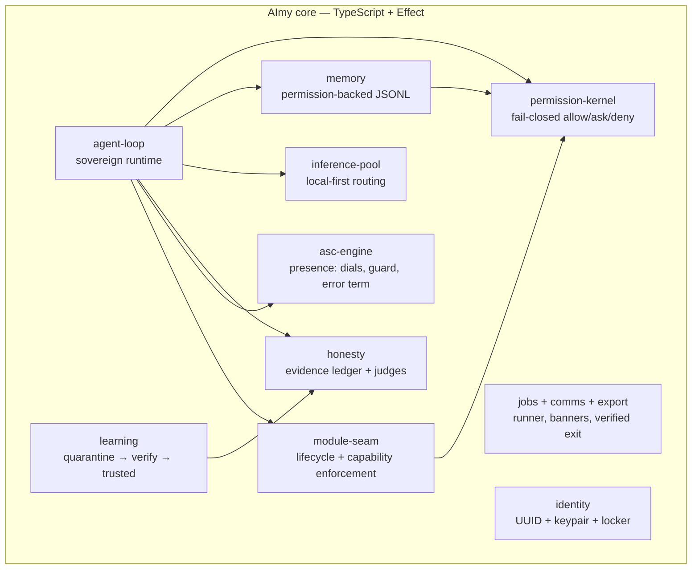

<p align="center">
  
</p>

<h1 align="center">AImy</h1>

<p align="center">
  <strong>The local-first AI companion platform.</strong><br/>
  Own the soul. Borrow the scar tissue.
</p>

<p align="center">
  
  
  
  
  
</p>

---

**The elephant in the room:** yes, another AI assistant — and the local-first premise isn't unique anymore. OpenClaw runs local. Hermes ran local. The idea that the model is interchangeable plumbing and the value is everything around it is shared with the best open projects.

AImy exists because those projects keep failing at the same things: agents that hallucinate without consequence, self-improvement loops that grade their own homework, personalities that are performed rather than computed, memory that silently corrupts. We spent the teardown phase studying exactly how Pi and Hermes failed — and built the mechanisms that answer each failure. That's the bet: not a different premise, **different machinery**.

## Who it's for

| You | Why AImy |
|---|---|
| **Technical enthusiasts** | An all-purpose, deeply configurable desktop companion you can grow — a platform, not a chatbot |
| **Burned by cloud AI** | No price hikes, no quiet model swaps, no "updated privacy policy" emails, no vanishing features |
| **Burned by hallucinations** | Claims carry evidence or get flagged. You get the receipt, not the apology |

If none of that stings, this probably isn't for you. That's fine.

## What makes it different

### 1. Local-first that's real, not marketing
Zero-socket boot — runs fully offline. No account, no API key, no telemetry, no phone-home. Bring your own model (Ollama, llama.cpp, LM Studio). Air-gap it if you want. Sovereignty here means *control and exit*, not a slogan.

### 2. Honesty is structural, not a prompt
Every claim carries a badge — ✅ *verified*, ⚠️ *unverified*, ❌ *failed* — backed by an evidence ledger and executable judges. Not "please don't hallucinate" in a system prompt. Architecture: **no code path produces a verified badge without evidence.**

### 3. Presence, not performance
The ASC engine computes four dials — warmth, playfulness, intensity, vulnerability — from actual conversation content and system state. *Computed, never chosen* (a test proves no code path can set them directly). An error term keeps the system's self-model calibrated against its real track record; a guard flags impression management. No other assistant has this.

### 4. Sovereignty = ownership + exit
One-click export of everything — memory, skills, identity, learning history — as a verified bundle with an independently checkable integrity receipt. "No one can take it from you" only means something if *you* can take all of you, trivially.

### 5. It gets better without getting dangerous
The learning loop improves AImy from experience — but new skills clear a verification arm with executable evidence. Promoting a skill on a model's say-so alone isn't against policy; **it's a type error**. Structurally impossible, not discouraged.

## What it's not

- **Not a frontier-model competitor.** The model is borrowed; the soul is owned.
- **Not a cloud service.** No server to sign up for, no tier to subscribe to.
- **Not finished.** v0 — the engine is built and tested, the desktop shell is landing now.

## How it fits together



<details>
<summary><strong>Repository map</strong></summary>

- `core/` — sovereign foundation libraries: substrate, permission-kernel, memory, inference-pool, asc-engine, module-seam, identity, agent-loop, honesty, learning, jobs, comms, export, web-research
- `architecture/` — system architecture v1.0
- `decomposition/` — Pi + Hermes agent teardown: harvest map + pitfalls checklist
- `planning/` — MVP MoSCoW v1.0 (locked scope contract)
- `assets/` — brand assets

</details>

## Run it

```sh
git clone git@github.com:kimlercorey/aimy-v0.git
cd aimy-v0/core
npm install
npm run chat -- --model <your-model> --base-url http://127.0.0.1:11434
```

Bring your own local model server — Ollama, llama.cpp, LM Studio, or anything serving OpenAI-style `/v1/chat/completions`. See [`core/CHAT.md`](core/CHAT.md) for details.

## Status

**17 of 18 MVP Musts built, tested, and pushed.** The desktop shell (the last one) is in progress. Scope contract: [`planning/mvp-moscow.md`](planning/mvp-moscow.md).
