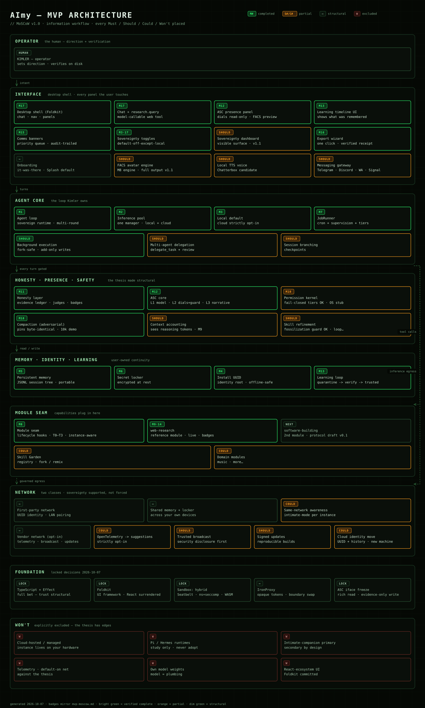

# AImy — MVP MoSCoW (v1.0 — FINAL, locked 2026-10-07)

*Sources: uber approach (Sovereignty / Continuity / Adaptive) · Pi+Hermes decomposition + pitfalls checklist · ASC paper (`workspace/user/files/paperASC.pdf`, Kimler + Ani, Sept 2026) · ThinkingBox executable-judges diagram. All open decisions resolved — see Locked decisions.*

**First-100 audience: technical enthusiasts** — acceptance criteria (especially #13's timeline UI and #17's polish bar) are judged against a technical enthusiast's eye, not a consumer's.

**Status badges (updated 2026-10-07):** ✅ verified — built, tested, pushed, acceptance green · ⚠️ unverified — partial, in flight, or not started · ❌ failed — claimed but broken.

## MUST — the MVP doesn't exist without these

1. ✅ **Sovereign agent runtime we own** — the loop is ours (TypeScript core). Study Pi/Hermes, adopt neither runtime.
2. ✅ **Inference pool / inference manager** — all inference routed through one manager; providers/endpoints (local network, cloud via LiteLLM-style abstraction) added as a single powerhouse or parallel threads. Generalizes the model-abstraction must-have into the scheduling core. *(Cloud here means cloud **models** as opt-in providers, governed by #3 — cloud-**hosted** AImy, i.e. your instance running on someone else's infrastructure, is explicitly Won't. The instance always lives on hardware you control.)*
3. ✅ **Local default, cloud strictly opt-in** — local model endpoint out of the box. No keyless fallbacks, no telemetry, no default-on network calls. (Inverts both projects' defaults.)
4. ✅ **Install UUID + instance identity** — generated locally at first install; keys all per-instance state (memories, skills, locker, evolution). The UUID itself is local and offline-safe. ⚠️ *Any reporting of UUIDs outward (instance counts, versions) is strictly opt-in — see tension note.*
5. ✅ **Persistent memory, user-owned** — JSONL session-tree design (Pi pattern), on-disk, portable. Memory sits behind the permission system from day one.
6. ✅ **Local secret locker** — in-app, encrypted at rest; the trust anchor for memories, keys, and per-instance secrets.
7. ✅ **Internal job runner** — in-app scheduler for background tasks, cron jobs, long-running work. Prerequisite for background execution and status alerts.
8. ✅ **MCP module system** — lifecycle-hook taxonomy as the seam modules hang off (Pi's best pattern). Modules are instance-aware by design (a module can know *which* AImy it runs on).
9. ✅ **One reference domain module proving the seam end-to-end** — web-research (locked 2026-10-07; software-building goes second).
10. ⚠️ **Fail-closed permission/sandboxing** — per-tool allow/ask/deny; denial kills the intent, not just the call; every code-execution path gated; sandbox selection fail-closed. *(Permission tiers verified; OS sandbox backends are honest stubs — real backends land after MVP.)*
11. ✅ **Honesty/validation layer** — verification evidence attached to claims; research answers grounded. **ThinkingBox-style executable judges** as the mechanism: deterministic, versioned checks over final state, side effects, and dialogue resolution → PASS/FAIL verdict per task. Self-written skills ship with an independent verification arm (Hermes #25833/#96704).
12. ✅ **ASC core (from the paper)** — L1 self-model (capability map, track record, relational model), L2 self-monitoring (four dials: Warmth/Playfulness/Intensity/Vulnerability, computed not chosen; other-model guard flags impression management), L3 self-narration (persistent story *including the system's own errors*). The error term keeps the self-model calibrated to the track record. This is the presence + honesty engine — and neither Pi nor Hermes has it.
13. ✅ **Learning loop v1** — skill creation from experience + **learning timeline UI** (show the user what was remembered — the trust mechanism). *(Loop verified end-to-end (M6); timeline UI built in M8.)*
14. ✅ **Web research capability** — real-world validation methods, not just model knowledge.
15. ✅ **In-app comms banner infrastructure** — the channel by which the system alerts the user (long-running job done, cron status). Product-owner broadcast reuses this channel (see Should, with conditions).
16. ✅ **One-click full data export** — memory, skills, identity, locker manifest. "No one can take it from you" requires *you* can take all of you, trivially.
17. ✅ **Desktop app shell, graphically polished** — beauty is a pillar, not a coat of paint. *(M8 complete 2026-10-07: Foldkit shell, ASC panel with read-only dials, FACS engine, sovereignty toggles default-off-except-local-inference, timeline/jobs/banners views, export wizard, onboarding, DevTools gated; 871/871 tests green.)*
18. ✅ **Compaction treated as adversarial** — the buggiest subsystem in both repos gets its own test/quarantine discipline from day one. *(M9 complete 2026-10-07: reasoning-token-aware accounting with Pi #9409 auto-tightening, cache-prefix contract, PinRegistry byte-identity, lifecycle/outcome audit, property tests; the discipline caught real bugs — O(n³)→O(n) invariant check, missing budget relief, timestamp carry-through; 10k-turn demo: 13 compactions, cache-hit 1.00×13, max pressure 70.1%, pins byte-identical; 919/919 tests green.)*

## SHOULD — high value, not MVP-blocking

- ⚠️ **ASC simultaneous interaction channels** — the multi-queue comm architecture from Kimler's Hermes work: full response via chat (information *for* the user), TTS voice (information *to* the user), FACS Action Units driving avatar/abstract expression. Dynamic biasing for verification on novel task types. (Framework in MVP via M8's FACS engine; full simultaneous output v1.1.)
- ⚠️ **Local TTS voice customization** — user-chosen local model/runtime; Chatterbox as default candidate.
- ⚠️ **Initial FACS expression avatar** — first expression engine (avatar or abstract), driven by the ASC dials. *(Engine in M8.)*
- ⚠️ **Messaging gateway** (Telegram/Discord/WhatsApp/Signal) — Hermes pattern, studied not adopted.
- ✅ **Background/unattended execution with fork safety** — autonomous work may add, never replace/remove; fail-closed. *(M6: idle-gated forks, bounded-cancel, add-only staged writes.)*
- ⚠️ **Skill refinement loop** — skills improve with use; fossilization guard (transient failures must not become permanent avoidance — Hermes #6051). *(Guard built in M6; improvement-with-use loop partial.)*
- ⚠️ **Multi-agent delegation** — `delegate_task` + review subagents.
- ⚠️ **Session branching / checkpoints.**
- ⚠️ **Context accounting that sees reasoning tokens** — sessions must never wedge silently at the ceiling (Pi #9409). *(M9.)*
- ⚠️ **Image processing support** — multimodal input.
- ⚠️ **Trusted broadcast** (reuses the Must-have banner infra) — primary duty is **security-flaw disclosure**: when we find a serious flaw we do our due diligence and notify the users who opted in to that trust. Secondary: critical product comms to verified cohorts (version, community, subscriber). Strictly opt-in, transparent, auditable. Framed as duty of care, not marketing — this is how the broadcast channel earns its existence. *(Capability seam built in M7 — local code structurally cannot forge it; no live broadcast yet. NOTE: pairs with signed updates — disclosure without verified delivery is theater; sequence them together.)*
- ⚠️ **Sovereignty dashboard** — every network call the app wants to make, listed with toggles; verifiable offline mode. Turns the thesis into a visible product surface. (The toggles are Must, in M8; the dashboard UI is Should.)
- ⚠️ **Signed updates / reproducible builds** — the update channel must be verifiable, especially once a broadcast channel exists. *(NOTE: sequence with trusted broadcast — see above.)*

## COULD — if time and momentum allow

- ⚠️ **Skill Garden** — public registry, fork/remix, ratings (the Obsidian/Raycast flywheel).
- ⚠️ **Cloud identity copy/move service** — move an AImy's full identity (UUID, uniqueness, history, memories) between machines via an optional cloud service.
- ⚠️ **Same-network instance awareness** — e.g. three systems share memories + secret locker, but only the office instance enters intimate mode. Instance-aware modules make this possible; full LAN sharing is v2 complexity.
- ⚠️ **OpenTelemetry (opt-in) → suggestion engine** — error reporting and plugin telemetry feeding an eventual plugin suggestion flywheel. Strictly opt-in; off by default.
- ⚠️ Voice interface (full duplex).
- ⚠️ Additional domain MCP modules (music, etc.).
- ⚠️ Collaboration rooms / multi-user.
- ⚠️ Mobile companion.

## WON'T — explicitly out for MVP

- Cloud-hosted or managed modes — against the sovereignty thesis.
- Wholesale adoption of Pi or Hermes runtimes — study only.
- Intimate-companion as the primary mode — secondary by design.
- Any telemetry, default-on network calls, or keyless fallbacks.
- Training or shipping our own model weights — the model is interchangeable plumbing by thesis; we own the runtime, not the weights.
- (Pending stack decision: React-ecosystem UI if we commit to Effect/Foldkit.)

## Position: sovereignty is supported, not forced (Kimler, 2026-10-07)

AImy supports full sovereignty — complete offline functionality, zero degradation for the hermit. But isolation is **not** forced: there is large opportunity in community (shared skills, recommendations, network effects) and in multi-instance LAN (shared memories, secret locker across your own devices). The principle: **the user is sovereign over their own sovereignty setting.** No coercion in either direction — forced isolation would be paternalism, forced connection would break the thesis.

Two network classes, different trust profiles:

- **First-party network (your own instances):** UUID identity, LAN discovery/pairing, shared memory + secret locker, instance-aware modules (e.g. only the office instance enters intimate mode). This is sovereignty *extended* across your devices, not compromised. Design for it from day one — the UUID system is enabler foundation here, not phone-home.
- **Vendor network (us):** instance counting, error/plugin telemetry, trusted broadcast (security disclosure first), suggestion engine, and later the opt-in community page (enthusiast connections, support center). Every item opt-in, off by default, dashboard-listed, revocable, with the value exchange stated plainly.

Non-negotiable: full functionality offline; no feature held hostage to connectivity; defaults respect the thesis; everything revocable. What we promise is not "you are isolated" — it's "you decide, and we can't override you."

## Locked decisions (2026-10-07, Kimler approved)

- **Language + substrate: TypeScript + Effect, full bet.** Trust made structural; the first 100 are technical enthusiasts.
- **UI framework: Foldkit.** Coherent with the Effect bet; React ecosystem surrendered deliberately.
- **First reference domain module: web-research.** Honesty pillar made visible; exercises the ThinkingBox judges; tighter scope than software-building (which goes second).
- **ASC dial defaults: ship the paper's defaults; expose tuning as a user control.** "Tune my affect" is a differentiator.
- **WON'T updated:** no React-ecosystem UI (Foldkit committed).
- **Sandbox backend (locked 2026-10-07):** hybrid — OS-native per platform at MVP (Seatbelt/macOS, namespaces+seccomp/Linux), WASM for portable skill scripts, in-process permission gate for T0/T1. Container runtime dependency rejected (kills the install story); hardened Windows sandboxing deferred. Gates the IronProxy pattern and the software-building module's code execution.
- **ASC Engine interface freeze (locked 2026-10-07):** rich read, minimal write. Full observability across the boundary (dial history, error-term values, guard flags, L3 narrative stream) — transparency is the product. Writes restricted to evidence updates only. Everything versioned; reads may expand, writes are frozen.
